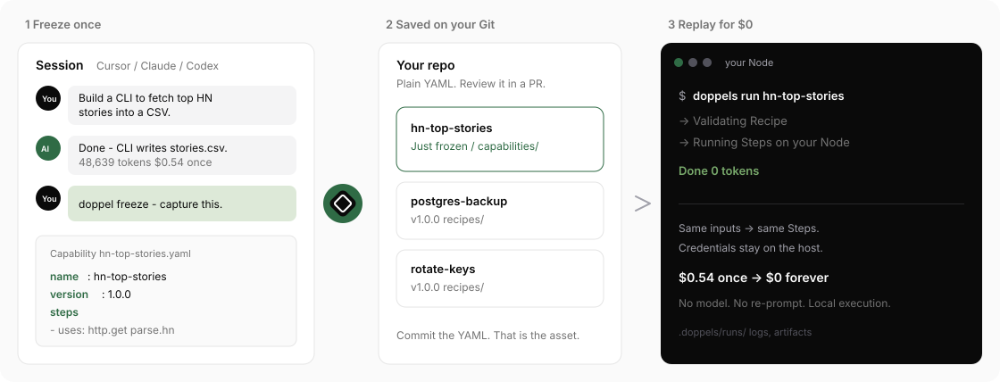

<p align="center">
  
</p>

<h1 align="center">Doppels</h1>

<p align="center"><strong>Freeze your AI operations</strong></p>

<p align="center">Turn AI processes into deterministic local Capabilities.</p>

<p align="center">
  <a href="https://doppels.so">Website</a> ·
  <a href="https://docs.doppels.so">Docs</a> ·
  <a href="LICENSE">Apache-2.0</a>
</p>

<p align="center">
  
  
</p>

<p align="center">
  
</p>

You explore with an agent. You get something that works once. Next week you re-prompt and hope.

Doppels turns that session into a **Capability** (the public contract) and a **Recipe** (how it runs on *your* machine)—typed, validated, replayable. Execution never leaves the host. Credentials stay where they already are (`aws`, `gcloud`, `psql`, SSH, VPN). Replay costs **zero tokens**.

> **Status:** pre-alpha. Latest tagged build is a **prerelease** (`v0.0.0-dev.*`) to exercise the release pipeline — not a product launch.

## Why

Coding agents are great at discovery and terrible at memory. Scripts in chat die. Docs drift. Re-running “that migration” means starting over.

Doppels is the freeze button:

1. **Freeze once** — agent (or you) captures the working path as YAML.
2. **Commit it** — Capability + Recipe live in your repo, reviewed like any other source.
3. **Replay for $0** — `doppels run` executes locally. Same inputs → same Steps → auditable result.

## How it works

```text
Cursor / Claude / Codex          Your repo
        │                              │
        │  explore, fix, ship once     │
        ▼                              │
   doppel freeze (skill)               │
        │                              │
        │  writes YAML                 ▼
        └──────────────────►  capabilities/<name>.yaml
                              recipes/<name>.yaml   (optional)
                                        │
                                        ▼
                              doppels validate
                              doppels run capability/<name>
                                        │
                                        ▼
                              .doppels/runs/<id>/   (logs, artifacts)
```

- **Capability** = what it does (inputs / outputs). The public contract.
- **Recipe** = how it runs (Steps, shell, `requires`, `returns`). Written to `recipes/` in **your** project — commit it to git like any other source.
- **Run** = one local attempt with fixed inputs. History lives under `.doppels/` (runtime; usually gitignored).

## Install the CLI

Pick one. Binary name is **`doppels`** (not `doppel`).

### curl

```console
curl -fsSL https://doppels.so/install.sh | sh
```

Same script from GitHub: `https://raw.githubusercontent.com/doppelshq/doppels/main/install.sh`.

Defaults to `~/.local/bin/doppels`. If that directory is not on `PATH`:

```console
export PATH="$HOME/.local/bin:$PATH"
```

Pin a tag (useful while only prereleases exist):

```console
curl -fsSL https://doppels.so/install.sh \
  | DOPPELS_VERSION=v0.0.0-dev.1 sh
```

### Homebrew

```console
brew tap doppelshq/tap
brew trust doppelshq/tap   # Homebrew 6+
brew install doppels
```

Later (stable release only): submit a formula to
[Homebrew/homebrew-core](https://github.com/Homebrew/homebrew-core) so
`brew install doppels` works without a tap. Do not PR prerelease/`*-dev` tags.

### From source ([mise](https://mise.jdx.dev))

```console
git clone https://github.com/doppelshq/doppels.git
cd doppels
mise install
task setup
task build:cli          # → ./bin/doppels
```

With the mise shell hook, `bin/` is on `PATH`.

Check any install:

```console
doppels --version
```

Artifacts: [GitHub Releases](https://github.com/doppelshq/doppels/releases).

## Freeze from Cursor, Claude, or Codex

**1. Install the skill** (once per machine or project):

```console
npx skills add doppelshq/doppels --skill doppel-freeze
```

**2. Do real work in the agent** — deploy, migrate, fix prod, whatever you want to repeat later.

**3. Freeze** — say something like:

> doppel freeze — turn what we just did into a Capability

The skill then:

1. Checks `doppels` is on `PATH` (or points you at install steps above).
2. Runs `doppels spaces init` if the folder has no `.doppels/` yet.
3. Asks what to capture (one Capability per distinct outcome).
4. Reads the session (commands, files, inputs, outputs) and **writes YAML by hand** — there is no `doppels freeze` generator command.
5. Loops `doppels validate` and test `doppels run …` when safe until clean.
6. Shows you the contract and asks before treating it as done. **Commit** the YAML when you are happy — that is the repeatable asset.

Skill internals: [`skills/doppel-freeze/SKILL.md`](skills/doppel-freeze/SKILL.md) and [`skills/doppel-freeze/references/`](skills/doppel-freeze/references/).

## CLI workflow

From any project directory:

```console
doppels spaces init              # capabilities/, recipes/, .doppels/
doppels validate                 # all manifests under discovery paths
doppels capabilities list        # what you have locally
doppels describe capability/greet
doppels run capability/greet --input name=Ada --yes
doppels runs list
doppels runs show <run-id>
doppels runs logs <run-id>
```

Machine-readable output: add `--json` to most commands.

### Quickstart (copy-paste)

From a source checkout:

```console
cd examples/quickstart
../../bin/doppels validate
../../bin/doppels run capability/greet --input name=Ada --yes
../../bin/doppels runs list
```

If `doppels` is already on `PATH`, run the same commands without the `../../bin/` prefix.

That Space includes `greet`, a multi-step `release-pipeline`, and a Capability with no Recipe (`manual-review`).

### Minimal manifests

See [`examples/quickstart/capabilities/greet.yaml`](examples/quickstart/capabilities/greet.yaml) and [`examples/quickstart/recipes/greet.yaml`](examples/quickstart/recipes/greet.yaml). More samples in [`skills/doppel-freeze/references/examples/`](skills/doppel-freeze/references/examples/). Full schema: [`schemas/`](schemas/).

## What’s in this repo

```text
apps/cli/              Go runtime (validate, run, local history)
schemas/               JSON Schema contracts (source of truth)
skills/doppel-freeze/  Agent skill for Cursor / Claude / Codex
skills/doppel-use/     Draft — blocked on MCP
examples/quickstart/   Local Space you can run offline
docs/images/           README diagram (Session → Capability → Run)
install.sh             curl installer
```

## Links

- [doppels.so](https://doppels.so)
- [docs.doppels.so](https://docs.doppels.so)
- [Homebrew tap](https://github.com/doppelshq/homebrew-tap)
- [CONTRIBUTING.md](CONTRIBUTING.md) (DCO + CLA)
- [LICENSE](LICENSE) and [NOTICE](NOTICE) — Apache-2.0
