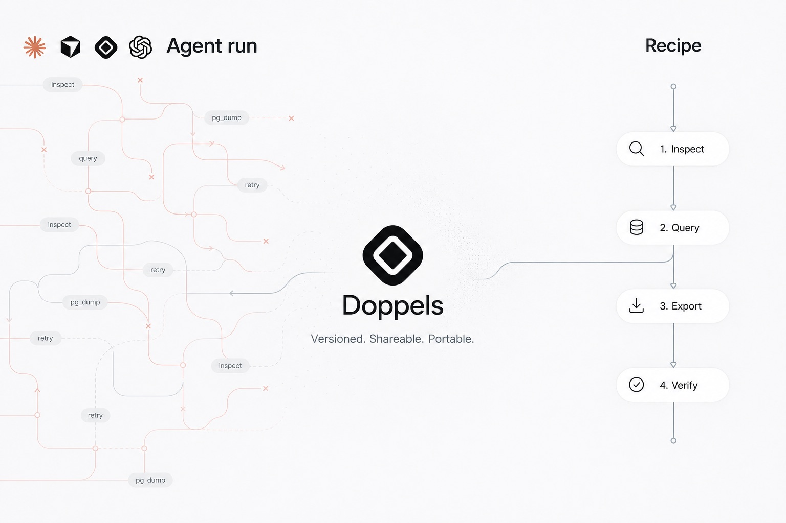
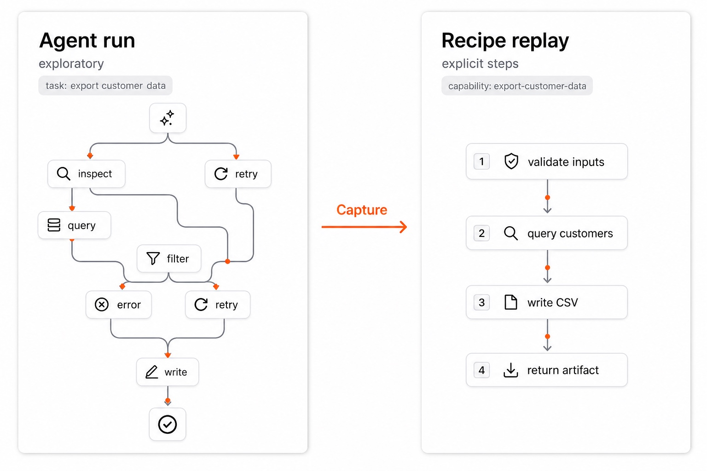
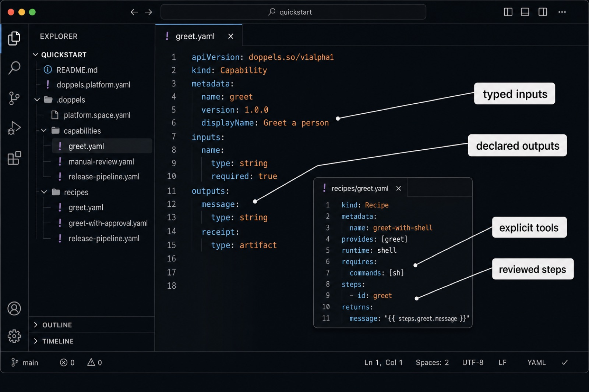
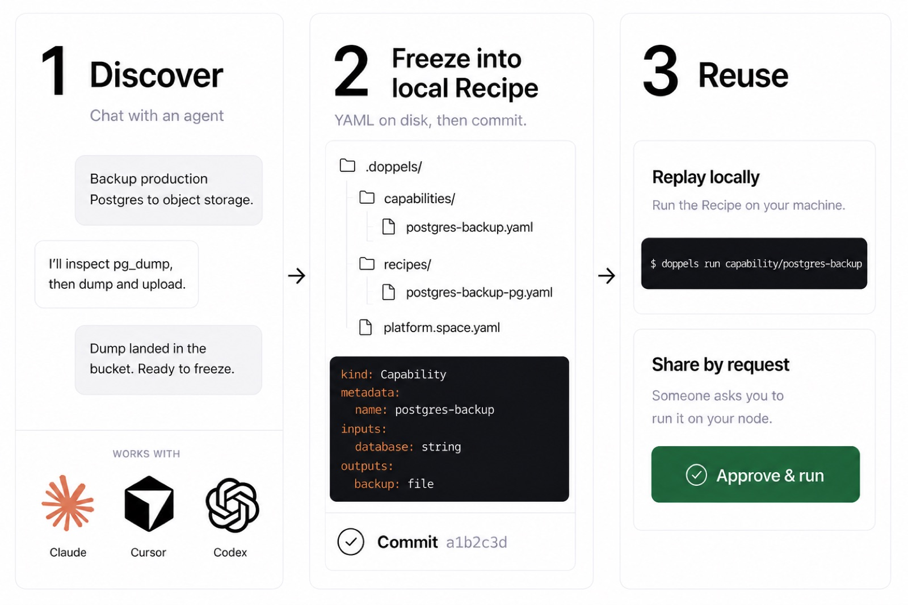
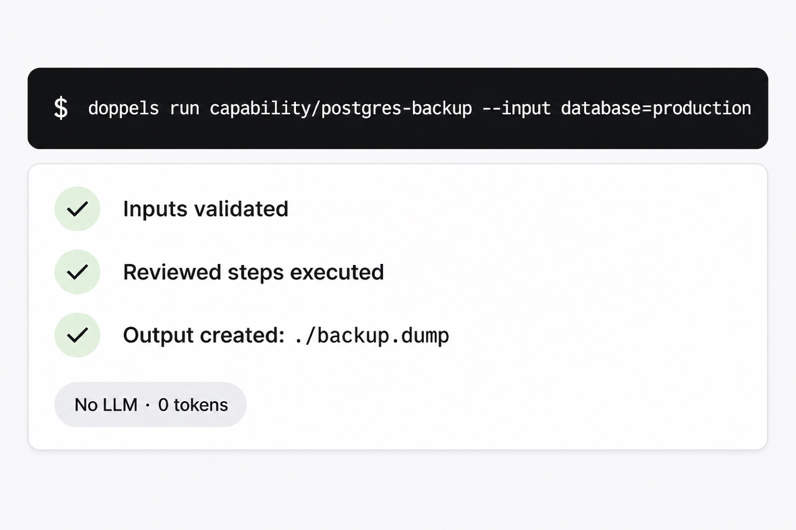
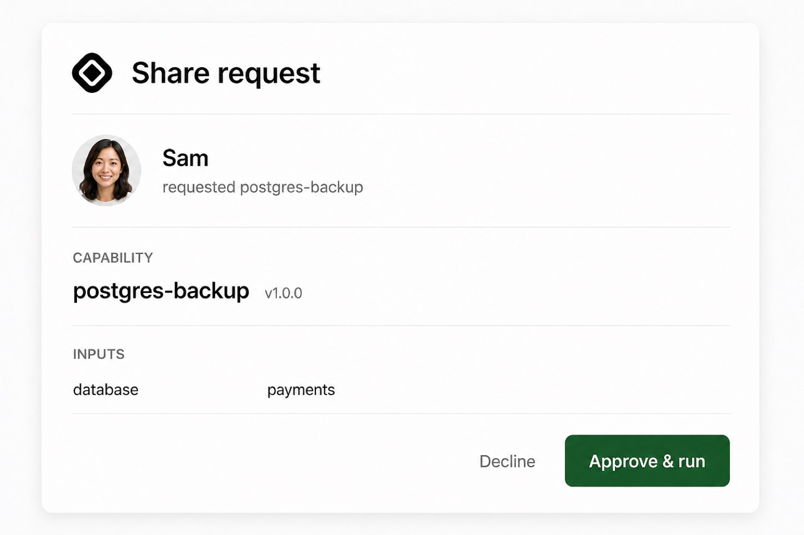
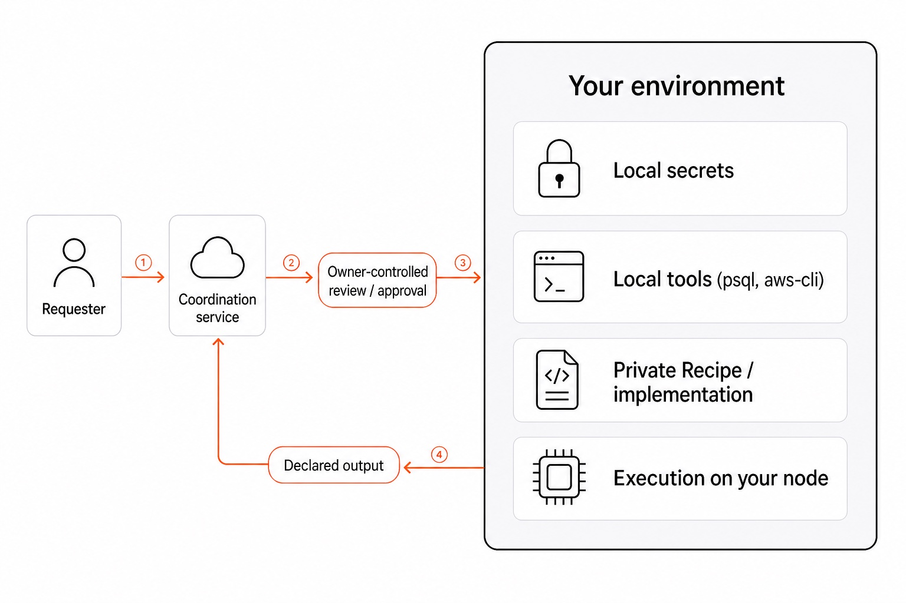
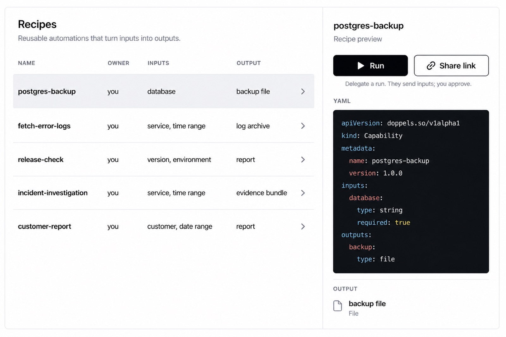
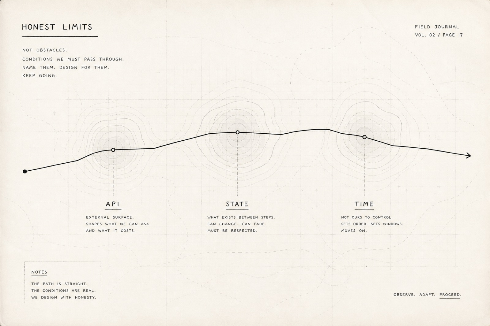
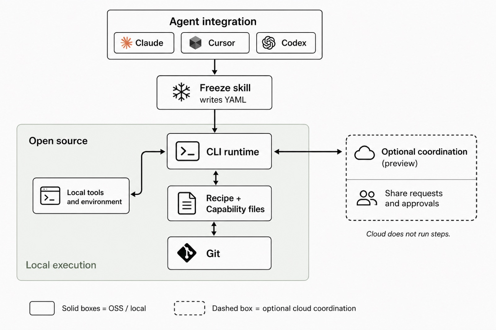

<p align="center">
  
</p>

<h1 align="center">Doppels</h1>

<p align="center"><strong>Freeze successful agent runs into inspectable, reusable Recipes.</strong></p>

<p align="center">
  Agents are great at discovering how to complete a task. Doppels preserves the successful path as a local, reviewable Recipe—so you can replay it on your machine, or let someone request an approved execution in your environment.
</p>

<p align="center">
  <a href="https://doppels.so">Website</a>
  ·
  <a href="https://docs.doppels.so">Docs</a>
  ·
  <a href="#examples">Examples</a>
  ·
  <a href="#security-model">Security</a>
  ·
  <a href="CONTRIBUTING.md">Contributing</a>
  ·
  <a href="LICENSE">Apache 2.0</a>
</p>

<p align="center">
  
  
</p>

<p align="center">
  
</p>

## Quick start

Install the **`doppels`** CLI, then add the [freeze skill](https://docs.doppels.so/skills/doppel-freeze) so your agent can write YAML.

```bash
# Install (macOS, Linux, Windows via WSL2)
curl -fsSL https://doppels.so/install.sh | sh

# Teach your agent how to freeze a successful run
npx skills add doppelshq/doppels --skill doppel-freeze
```

Do the real work in Claude Code, Cursor, Codex, or another supported agent. When it works, tell the agent:

> doppel freeze — turn what we just did into a Capability

The skill writes a **Capability** (the public contract) and a **Recipe** (the local steps) into your repo, then loops `doppels validate` until clean. Commit the YAML. That is the asset.

```bash
# Replay the frozen Capability locally
doppels run capability/postgres-backup --input database=production
```

Try the bundled demo first:

```bash
cd examples/demo
doppels validate
doppels run capability/greet --input name=Ada --yes
```

Homebrew: `brew tap doppelshq/tap && brew trust doppelshq/tap && brew install --cask doppels`. Pin a release with `DOPPELS_VERSION=v0.1.0-alpha.1`. Installs to `~/.local/bin/doppels`. Full options: [installation](https://docs.doppels.so/installation).

## Why Doppels?

Agents often rediscover the same operational path: inspect the environment, choose tools, recover from errors, and refine the approach until it works.

That exploration is valuable the first time. After that, replay the reviewed path.

> **Agents discover the path. Doppels preserves it.**

| | Agent run | Recipe replay |
|---|---|---|
| Execution | Exploratory | Explicit, reviewed steps |
| LLM required | Yes | No |
| Token usage | Depends on the run | 0 |
| Reviewable before execution | Partially | Yes |
| Versionable in Git | No | Yes |

<p align="center">
  
</p>

## What gets frozen?

Freeze captures the execution contract as two YAML files.

A **Capability** is the public contract (inputs and outputs):

```yaml
apiVersion: doppels.so/v1alpha1
kind: Capability

metadata:
  name: postgres-backup
  version: 1.0.0

inputs:
  database:
    type: string
    required: true

outputs:
  backup:
    type: file
```

A **Recipe** is the local how. It declares `provides`, runs on your machine, and maps `returns` to the Capability:

```yaml
apiVersion: doppels.so/v1alpha1
kind: Recipe

metadata:
  name: postgres-backup-pg
  version: 1.0.0

provides: [postgres-backup]
runtime: shell

requires:
  commands: [sh, pg_dump]

steps:
  - id: dump
    name: Dump database
    env:
      DATABASE: "{{ inputs.database }}"
    run:
      shell: sh
      script: |
        pg_dump "$DATABASE" > backup.dump
    produces:
      backup:
        file: backup.dump

returns:
  backup: "{{ steps.dump.backup }}"
```

A freeze can describe:

- Typed and validated inputs (Capability)
- Tools, `requires`, and the reviewed order of Steps (Recipe)
- Declared outputs / `returns`
- References to local secrets
- Runtime requirements and metadata

Review the YAML before you run it. Credentials stay on the host.

<p align="center">
  
</p>

Schemas: [`schemas/`](schemas/). YAML reference: [docs](https://docs.doppels.so/reference/yaml-schemas).

## How it works

1. Use Claude Code, Cursor, Codex, or another supported agent to complete a task.
2. Once the run succeeds, ask the agent to freeze it (`doppel freeze`). The [doppel-freeze skill](skills/doppel-freeze/SKILL.md) writes Capability + Recipe YAML.
3. Review the generated files and commit them to Git.
4. Replay locally with `doppels run`, or share as an approval-gated Capability.

```text
Agent explores → Successful run → Freeze (skill) → Capability + Recipe
                                                      ├─ Replay locally
                                                      └─ Share by request
```

<p align="center">
  
</p>

## Replay locally

Run the reviewed path again:

```bash
doppels run capability/postgres-backup \
  --input database=production
```

```text
✓ Inputs validated
✓ Reviewed steps executed
✓ Output created: ./backup.dump
```

Replay uses the Recipe's explicit Steps and your local tools, credentials, and environment. `--yes` auto-approves Steps that declare an approval prompt.

Guide: [Validate and run](https://docs.doppels.so/guides/validate-and-run). CLI reference: [docs](https://docs.doppels.so/reference/cli).

<p align="center">
  
</p>

## Share the capability

Share is included from day one, free. Create a request link for a Capability:

```bash
doppels share capability/postgres-backup
```

The requester supplies the declared inputs. You review the request (`doppels listen`), approve it, and the Recipe runs in your environment. They receive the declared result.

> **They access the capability. Execution stays on your node.**

The request flow:

1. You share a Capability link.
2. The requester provides validated inputs.
3. You inspect and approve the request.
4. Your node executes the reviewed Recipe locally.
5. The declared result is returned and the Run is recorded.

YAML also travels over Git: commit, clone, `doppels validate`, `doppels run`. Guide: [Share](https://docs.doppels.so/guides/sharing).

<p align="center">
  
</p>

## Security model

Doppels is designed around an explicit boundary: coordination may happen remotely, but execution remains in the environment that owns the capability.

```text
Requester → Coordination service → Approval → Your node → Local tools
                                                        → Local secrets
                                                        → Declared output
```

Core principles:

- Recipes are inspectable before execution.
- Approval is required by default for shared requests (and for Steps that declare it).
- Credentials are referenced locally and stay on the host.
- Inputs are explicit and validated.
- Execution happens on the owner's node.
- Runs produce an audit record under `.doppels/`.
- Share publishes declared `returns`. The Recipe script stays on the node.

See the [share security notes](https://docs.doppels.so/guides/sharing) and [FAQ](https://docs.doppels.so/reference/faq) for trust boundaries and what the coordination service handles.

<p align="center">
  
</p>

## Examples

Runnable fixtures in this repo:

| Path | What it does |
|---|---|
| [`examples/demo`](examples/demo) | Instant `greet` Capability (CI-friendly) |
| [`examples/quickstart`](examples/quickstart) | Approval, manual review, and a small pipeline |
| [`examples/dev`](examples/dev) | Sandbox Space for CLI development |

The kind of work freeze is meant to capture:

| Capability | What it does | Inputs | Output |
|---|---|---|---|
| `postgres-backup` | Creates and verifies a database backup | Database | Backup file |
| `release-check` | Runs release-readiness checks | Version, environment | Validation report |
| `customer-report` | Generates a customer report | Customer, date range | Report |
| `incident-investigation` | Collects incident evidence | Service, time range | Evidence bundle |

Every published example should be executable and include its requirements, expected side effects, and test fixture.

<p align="center">
  
</p>

## Honest limits

Doppels preserves the **same reviewed execution path**. Results still depend on the world around that path.

- External state can change results.
- APIs, schemas, and tool behavior evolve.
- Side effects may be irreversible.
- Safe replay requires idempotency awareness.
- Non-deterministic tools remain non-deterministic.
- A Recipe is only as safe as its Steps, inputs, permissions, and review process.

Use dry runs, constrained credentials, explicit approvals, and environment-specific safeguards for sensitive workflows.

<p align="center">
  
</p>

## Architecture

```text
Agent integration
      ↓
Freeze skill → Capability + Recipe files → Git
                       ↓
                  CLI / runtime → Local tools and environment
                       ↕
              Share coordination
```

The core model separates:

- **Discovery:** an agent explores and completes the task.
- **Compilation:** the freeze skill converts the successful tool path into YAML.
- **Execution:** the runtime validates inputs and invokes explicit Steps locally.
- **Coordination:** Share handles requests and approvals. Credentials and Steps stay on the node.

<p align="center">
  
</p>

This repository is the Apache-2.0 core: CLI, schemas, and agent skills. Share ships from day one, free. Local `doppels run` still works on its own; Share uses the hosted control plane only to coordinate requests.

## Project status

Doppels is pre-alpha. Tagged builds are prereleases (`v0.1.0-alpha.*`). The Recipe format, supported integrations, and execution model may evolve.

Before using Doppels in production:

- Review generated YAML.
- Test it in a constrained environment.
- Use least-privilege credentials.
- Understand every side effect.
- Pin compatible tool and Capability versions.

Current work: [open issues](https://github.com/doppelshq/doppels/issues).

## Documentation

- [Installation](https://docs.doppels.so/installation)
- [Quickstart](https://docs.doppels.so/quickstart)
- [How it works](https://docs.doppels.so/concepts/how-it-works)
- [Freeze with an agent](https://docs.doppels.so/guides/freeze-with-agent)
- [Capabilities](https://docs.doppels.so/concepts/capabilities) · [Recipes](https://docs.doppels.so/concepts/recipes)
- [Validate and run](https://docs.doppels.so/guides/validate-and-run)
- [Share](https://docs.doppels.so/guides/sharing)
- [CLI reference](https://docs.doppels.so/reference/cli)
- [YAML schemas](https://docs.doppels.so/reference/yaml-schemas)
- [FAQ](https://docs.doppels.so/reference/faq)

## Contributing

Contributions are welcome. Start with [CONTRIBUTING.md](CONTRIBUTING.md) (DCO + CLA), browse [open issues](https://github.com/doppelshq/doppels/issues), or open a discussion before proposing a large change.

Please report security vulnerabilities privately to the maintainers.

## License

Licensed under the [Apache License 2.0](LICENSE). See [NOTICE](NOTICE).

---

**Run it once. Freeze it. Replay it. Share it.**
