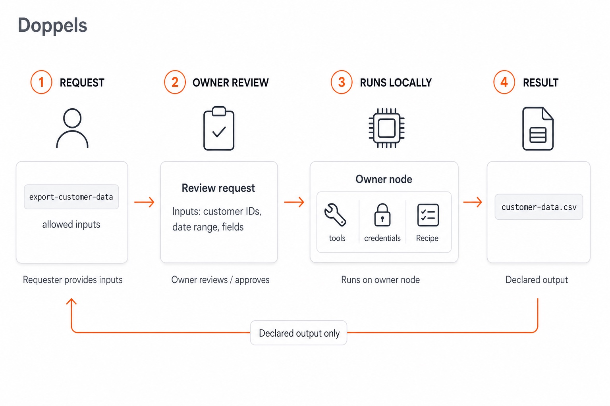

# Doppels

**Turn your expertise into infrastructure.**

[Website](https://doppels.so) · [Docs](https://docs.doppels.so) · [Examples](#examples) · [Security](#delegate-execution-keep-authority) · [Contributing](CONTRIBUTING.md) · [Apache 2.0](LICENSE)


Doppels turns recurring operational work into requestable Capabilities that execute in your environment, under your rules.

Someone requests. You review. Your node executes locally. They get the declared result — without getting your credentials, network access, or private implementation.

> **Delegate the request, not the authority.**

<p align="center">
  
</p>

## The problem

In companies, a small number of people hold the knowledge, credentials, environment, and authority to perform certain operational tasks. Everyone else interrupts them:

> "Can you pull the data for these customers?"
> "Can you rerun this?"
> "Can you check production?"

The task may take a few minutes. The interruption and context switching are expensive — and everyone else is blocked waiting for someone who is allowed to act.

Doppels lets that person turn recurring operational work into a **Capability** others can request. The requester supplies only the permitted inputs. The owner reviews the Request and fulfills it under their approval rules. The **Recipe** runs on the owner's node. The requester receives the declared output. Credentials, network access, implementation, and authority stay with the owner.

## Quickstart

Install the **`doppels`** CLI, then add the [freeze skill](https://docs.doppels.so/skills/doppel-freeze) so a supported coding agent can capture successful work as a Capability and Recipe.

```bash
# Install (macOS, Linux, Windows via WSL2)
curl -fsSL https://doppels.so/install.sh | sh

# Teach your agent how to capture a successful run
npx skills add doppelshq/doppels --skill doppel-freeze
```

Do the real work in Claude Code, Cursor, Codex, or another supported agent. When it works, tell the agent in chat (not in the terminal):

> doppel freeze — turn what we just did into a Capability

The skill writes a **Capability** (public contract) and a **Recipe** (local steps) into your Space, then loops `doppels validate` until clean. Review the YAML. Commit when you are ready to depend on it.

Try the bundled demo first:

```bash
cd examples/demo
doppels validate
doppels run capability/greet --input name=Ada --yes
```

Homebrew: `brew tap doppelshq/tap && brew trust doppelshq/tap && brew install --cask doppels`. Pin a release with `DOPPELS_VERSION=v0.1.0-alpha.1`. Installs to `~/.local/bin/doppels`. Full options: [installation](https://docs.doppels.so/installation).

## From work to a Capability

You solve a real task with your normal tools — and optionally an agent such as Claude Code, Cursor, or Codex. The agent helps produce scripts and steps quickly.

Doppels packages the reviewed result into:

- a **Capability** — what others may request
- a **Recipe** — how it runs on your machine

The agent helps you create it. Doppels lets you depend on it.

```text
Real work → Capture (skill) → Capability + Recipe → Git
                                    ├─ Run locally
                                    └─ Share by request
```

Guide: [Freeze with an agent](https://docs.doppels.so/guides/freeze-with-agent). Skill source: [`skills/doppel-freeze`](skills/doppel-freeze/SKILL.md).

## Capability vs Recipe

A **Capability** is the public, requestable contract: what it does, inputs, and outputs — what others are allowed to request.

A **Recipe** is the private implementation: Steps, scripts, commands, tools, `requires`, runtime configuration, and how `returns` map to those outputs. It declares one or more Capabilities with `provides`. The requester does not need to know how the Capability works internally.

## Example: `export-customer-data`

Company-specific operational work looks like this — **not** a fixture you can run from this repository.

Someone asks:

> "Can you pull the data for these customers?"

You capture that as a Capability, for example `export-customer-data`.

Possible inputs (illustrative):

- customer IDs
- date range
- fields / data requested

Possible declared output (illustrative):

- `customer-data.csv`

Flow:

1. Product / Support requests `export-customer-data` with permitted inputs.
2. You review the Request and fulfill it according to the Recipe's approval rules.
3. The Recipe executes on your node — using your real tools, network access, and credentials.
4. The declared result is returned (for example a CSV).
5. The Run is recorded under `.doppels/`.

The underlying Recipe might hit a production database, internal APIs, scripts, or VPN. Those details stay private and company-specific. Sharing the Capability does not share that implementation.

Real shapes from the bundled `greet` demo:

```yaml
# .doppels/capabilities/greet.yaml
apiVersion: doppels.so/v1alpha1
kind: Capability

metadata:
  name: greet
  version: 1.0.0

inputs:
  name:
    type: string
    required: true

outputs:
  message:
    type: string
```

```yaml
# .doppels/recipes/greet.yaml
apiVersion: doppels.so/v1alpha1
kind: Recipe

metadata:
  name: greet
  version: 1.0.0

provides: [greet]
runtime: shell

requires:
  commands: [sh]

steps:
  - id: greet
    name: Generate greeting
    env:
      NAME: "{{ inputs.name }}"
    run:
      shell: sh
      script: |
        export MESSAGE="Hello, $NAME"
        printf '%s\n' "$MESSAGE"
    produces:
      message:
        env: MESSAGE

returns:
  message: "{{ steps.greet.message }}"
```

What the capture typically includes:

- Typed, validated inputs (Capability)
- Tools, `requires`, and reviewed Step order (Recipe)
- Declared outputs / `returns`
- References to local secrets (not secret values)
- Runtime requirements and metadata

Review the YAML before you run it. Credentials stay on the host.

Schemas: [`schemas/`](schemas/). YAML reference: [docs](https://docs.doppels.so/reference/yaml-schemas).

## Delegate execution. Keep authority.

Sharing a Capability does **not** mean sharing access.

```bash
doppels share capability/greet
```

Keep `doppels share` running. When the requester supplies the declared inputs, the CLI presents the Request for review. Fulfillment follows the Recipe's approval rules: Steps that declare `approval: required` prompt in the CLI (or use `--yes`). The Recipe runs in your environment; they receive the declared `returns`.

For ongoing requests across the local catalog, sign in and bring the Node online with `doppels node up`. There you can approve, reject, or skip each Request before fulfillment.

> **They access the capability. Execution stays on your node.**

> **Doppels coordinates execution. It does not become your execution environment.**

Trust boundary:

```text
Requester → Coordination service → Owner review / approval → Your node → Local tools
                                                        → Local secrets
                                                        → Declared output
```

What stays true in the current model:

- The requester only controls declared, validated inputs.
- You review shared Requests before fulfillment (`doppels share` presents the Request; `doppels node up` lets you approve / reject / skip).
- Step-level approval follows the Recipe (`approval: required` prompts unless `--yes`).
- Recipes execute on the owner's node.
- Credentials are referenced locally and stay on the host.
- Network access and private Recipe implementation stay on the node.
- Share publishes declared `returns`; the Recipe script does not leave the node.
- Runs produce a local audit record under `.doppels/`.

YAML also travels over Git: commit, clone, `doppels validate`, `doppels run`. Guide: [Share](https://docs.doppels.so/guides/sharing). See also the [FAQ](https://docs.doppels.so/reference/faq) for trust boundaries and what the coordination service handles.

<p align="center">
  
</p>

## Deterministic reuse

Agent-assisted work may start exploratory. Once you review and capture a Recipe, you can rerun the same path without asking an agent to rediscover the procedure.

> **Agents discover the path. Doppels preserves it.**

| | Agent run | Recipe replay |
|---|---|---|
| Execution | Exploratory tool use | Explicit, reviewed Steps |
| Doppels runtime | Not involved | Validates inputs and runs the Recipe locally |
| Reconstructing the path | LLM rediscovers tools and steps | Recipe already encodes the reviewed path |
| Agent tokens for the replay itself | Depends on the run | None (tools the Recipe invokes may still have their own costs) |
| Reviewable before execution | Partially | Yes — Capability + Recipe YAML |
| Artifact in Git | Session is not the unit of record | Capability + Recipe YAML are versionable |

```bash
doppels run capability/greet --input name=Ada --yes
```

Replay uses the Recipe's explicit Steps and your local tools, credentials, and environment. Local `doppels run` treats the operator invocation as the grant for Steps marked `approval: required`. `--yes` auto-approves those Steps for shared fulfillment (`doppels share` / `doppels node up`).

Guide: [Validate and run](https://docs.doppels.so/guides/validate-and-run). CLI reference: [docs](https://docs.doppels.so/reference/cli).

<p align="center">
  
</p>

## Your operational library compounds

Each recurring interruption can become a Capability. Today, teammates need to know who to ask. Over time, they only need to know what to request — a versioned library of operational capabilities, for example:

- `export-customer-data`
- `rerun-customer-sync`
- `backfill-events`
- `production-diagnostics`

Those names are conceptual illustrations of company-specific work, not fixtures in this repo. You version Capabilities and Recipes in Git; teammates request outcomes without inheriting your authority.

## Examples

**Runnable fixtures in this repository:**

| Path | What it does |
|---|---|
| [`examples/demo`](examples/demo) | Instant `greet` Capability (CI-friendly) |
| [`examples/quickstart`](examples/quickstart) | Approval, manual review, and a small pipeline |
| [`examples/dev`](examples/dev) | Sandbox Space for CLI development |

**Conceptual examples** (private / company-shaped work — not runnable from this repo):

| Capability | What it illustrates |
|---|---|
| `export-customer-data` | Export permitted customer fields to a declared artifact |
| `rerun-customer-sync` | Rerun a sync the owner is allowed to trigger |
| `backfill-events` | Backfill events for a declared window |
| `production-diagnostics` | Collect diagnostics from an environment the owner can reach |

## Honest limits

Doppels preserves the **same reviewed execution path**. Results still depend on the world around that path.

- External state can change results.
- APIs, schemas, and tool behavior evolve.
- Side effects may be irreversible.
- Safe replay requires idempotency awareness.
- Non-deterministic tools remain non-deterministic.
- A Recipe is only as safe as its Steps, inputs, permissions, and review process.

Use dry runs, constrained credentials, explicit approvals, and environment-specific safeguards for sensitive workflows.

## Architecture

```text
Agent integration
      ↓
Freeze skill → Capability + Recipe files → Git
                       ↓
                  CLI / runtime → Local tools and environment
                       ↕
              Share coordination
```

The core model separates:

- **Discovery:** an agent (or a human) explores and completes the task.
- **Compilation:** the freeze skill converts the successful path into YAML.
- **Execution:** the runtime validates inputs and invokes explicit Steps locally.
- **Coordination:** Share delivers Requests to the owner's node; review and Step approval follow the Recipe's rules. Credentials and Steps stay on the node.

This repository is the Apache-2.0 core: CLI, schemas, and agent skills. Local `doppels run` works fully offline against that core. Share uses a hosted coordination service only for request links, Request delivery, and declared `returns` — Recipes, Steps, credentials, and execution stay on your node.

## Project status

Doppels is pre-alpha. Tagged builds are prereleases (`v0.1.0-alpha.*`). The Recipe format, supported integrations, and execution model may evolve.

Before using Doppels in production:

- Review generated YAML.
- Test it in a constrained environment.
- Use least-privilege credentials.
- Understand every side effect.
- Pin compatible tool and Capability versions.

Current work: [open issues](https://github.com/doppelshq/doppels/issues).

## Documentation

- [Installation](https://docs.doppels.so/installation)
- [Quickstart](https://docs.doppels.so/quickstart)
- [How it works](https://docs.doppels.so/concepts/how-it-works)
- [Freeze with an agent](https://docs.doppels.so/guides/freeze-with-agent)
- [Capabilities](https://docs.doppels.so/concepts/capabilities) · [Recipes](https://docs.doppels.so/concepts/recipes)
- [Validate and run](https://docs.doppels.so/guides/validate-and-run)
- [Share](https://docs.doppels.so/guides/sharing)
- [CLI reference](https://docs.doppels.so/reference/cli)
- [YAML schemas](https://docs.doppels.so/reference/yaml-schemas)
- [FAQ](https://docs.doppels.so/reference/faq)

## Contributing

Contributions are welcome. Start with [CONTRIBUTING.md](CONTRIBUTING.md) (DCO + CLA), browse [open issues](https://github.com/doppelshq/doppels/issues), or open a discussion before proposing a large change.

Please report security vulnerabilities privately to the maintainers.

## License

Licensed under the [Apache License 2.0](LICENSE). See [NOTICE](NOTICE).

---

**Delegate the request, not the authority.**
